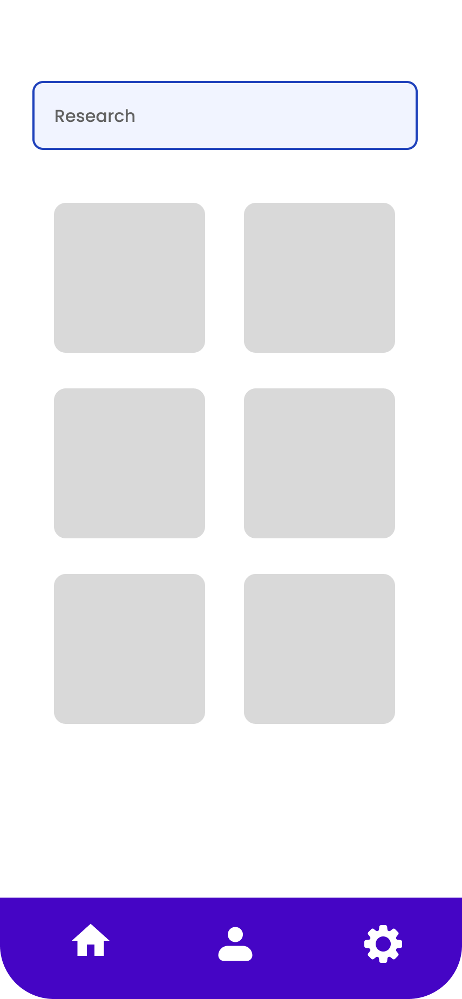
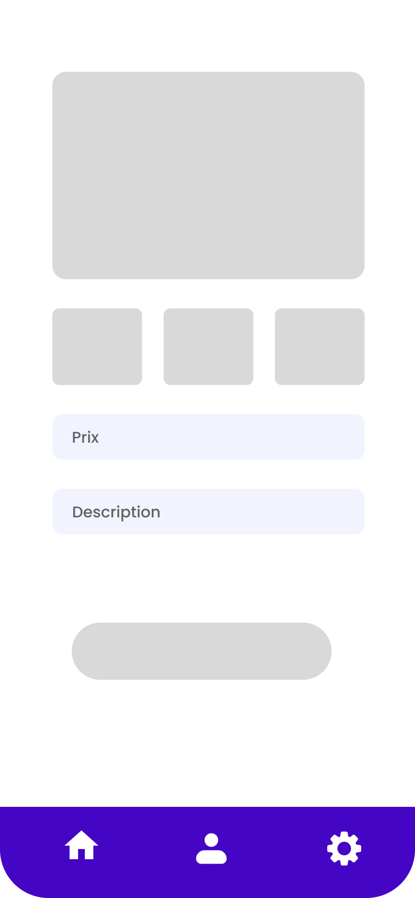

<!DOCTYPE html>
<html lang="fr">
<head>
<meta charset="UTF-8">
<meta name="viewport" content="width=device-width, initial-scale=1.0">
<title>WANDJAM - Gestion de salons de coiffure</title>
<<<<<<< HEAD
<link rel="stylesheet" href="style.css">
=======

>>>>>>> ab871f8499a36e67793f89302e031642fb351aaf
</head>
<body>

<h1>WANDJAM</h1>

Application mobile destinée à la gestion moderne des salons de coiffure. Wandjam facilite la relation entre les salons, les coiffeurs et les clients en regroupant les prestations, les rendez-vous, le suivi et la communication dans une seule plateforme intuitive.

<h2>Présentation générale</h2>

Wandjam est une solution simple et efficace qui permet aux salons de coiffure de mieux organiser leur activité quotidienne. L’application aide :

<ul>
  <li>les clients à réserver facilement,</li>
  <li>les coiffeurs à gérer leurs prestations,</li>
  <li>les propriétaires à suivre le fonctionnement global du salon.</li>
</ul>

<h2>Objectif principal</h2>

Digitaliser l’expérience capillaire, de la prise de rendez-vous jusqu’au suivi du service.

<h2>Fonctionnalités principales</h2>

<h3>Pour les clients</h3>
<ul>
  <li>Parcourir les salons disponibles</li>
  <li>Découvrir les styles et coiffures proposés</li>
  <li>Réserver un rendez-vous en quelques clics</li>
  <li>Voir l’historique de ses services</li>
</ul>

<h3>Pour les coiffeurs</h3>
<ul>
  <li>Visualisation des rendez-vous du jour</li>
  <li>Gestion des clients et des prestations réalisées</li>
  <li>Mise en avant de leurs coiffures (galerie)</li>
</ul>

<h3>Pour les propriétaires / administrateurs</h3>
<ul>
  <li>Gestion du salon (informations, horaires, images)</li>
  <li>Ajout et gestion des coiffeurs</li>
  <li>Suivi des prestations et activités du salon</li>
</ul>

<h2>Aperçu de la maquette</h2>

  
  
  
  
  
  

<h2>À propos du groupe</h2>

Nous sommes un groupe passionné par les technologies mobiles et la transformation digitale locale. Notre objectif est d’apporter des solutions modernes et accessibles pour améliorer les services du quotidien, notamment dans le domaine de la coiffure.

Wandjam reflète notre volonté d’offrir une expérience fluide, moderne et adaptée aux réalités des salons de notre région.

<h3>Getting Started</h3>

Ce projet constitue un point de départ pour une application Flutter.

Ressources utiles pour démarrer :

<ul>
  <li>Lab : Créez votre première application Flutter</li>
  <li>Cookbook : Exemples pratiques Flutter</li>
  <li>Documentation officielle Flutter : tutoriels, exemples, API complète</li>
</ul>

👉 <a href="https://docs.flutter.dev" target="_blank">https://docs.flutter.dev</a>

<h2>Licence</h2>

MIT

<h2>Contact</h2>

mit.cm

</body>
</html>
